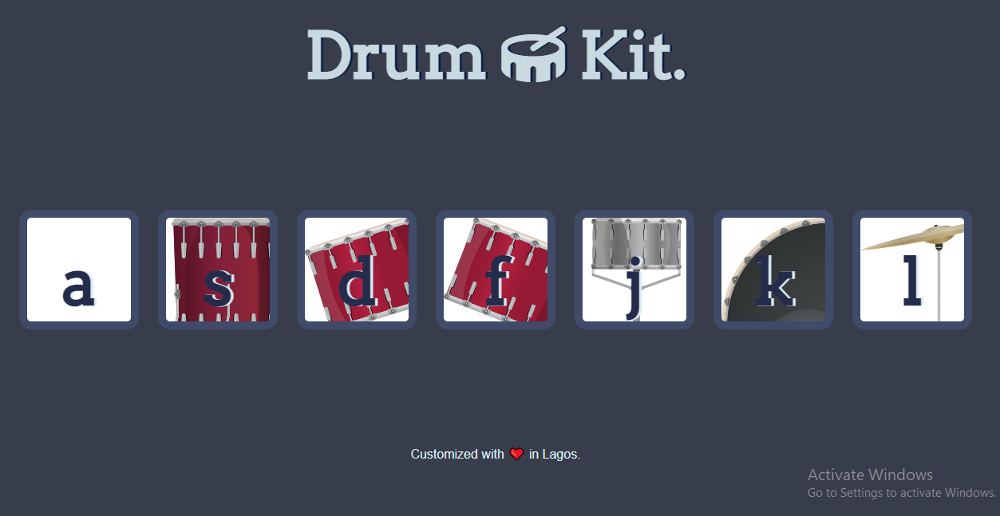

# Drum_Kit 🥁
### Screenshots

## Overview
Drum kit web, a basic test for DOM, and interaction between the keyboard(computer hardware) and the documents(HTML file)

### Links
- Live Site URL: [live page](https://byron-a.github.io/Drum_Kit/)

### Built with

- Semantic HTML5 markup
- CSS custom properties
- JavaScript

## Author
byron-a
- Website - https://byron-a.github.io/My_Resume/

